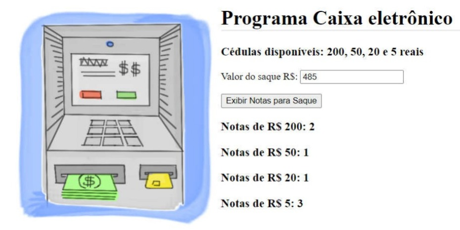

# ExerciciosLivro
Exercícios do livro: Lógica de Programação e Algoritmos com JavaScript de Edécio Fernando Iepsen

1) **Programa Caixa Eletrônico**
Num caixa eletrônico apenas notas de 200, 50, 20 e 5 reais estão disponíveis para saque. Elabore um programa que leia um valor de saque
de um cliente, verifique sua validade (ou seja, se pode ser pago com as notas disponíveis) e informe o número mínimo de notas de 200, 50, 20 e 5 necessárias para
pagar esse saque.
Obs.:
1: Crie uma condição que mostre uma mensagem por alert() se o cliente não preencher o campo com o valor do saque ou se não informar um valor válido (NaN).
2: O título da página deve conter as iniciais do seu nome após a palavra BANCO.

